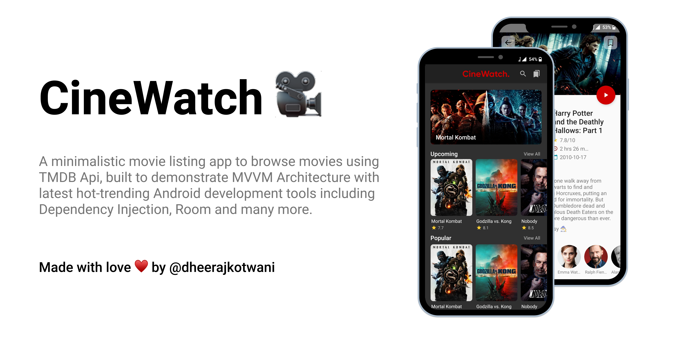
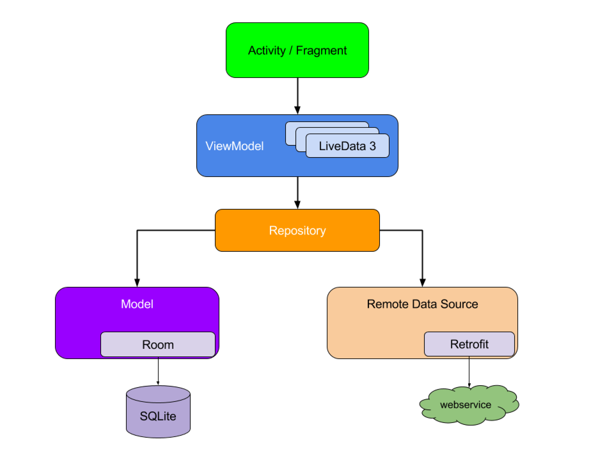

# CineWatch 🎥

A minimalistic movie listing app to browse movies using TMDB Api, built to demonstrate MVVM Architecture with latest hot-trending Android development tools including Dependency Injection, Room and many more.

## Features 🚀

- Explore the Upcoming, Popular and Top Rated Movies.
- Get detailed decription of all the movies.
- Get details about the Cast and Crew members.
- Bookmark your favourite movies.
- Get movies trailer within the application.
- Search for movies.

## Built With 🛠

- [Kotlin](https://kotlinlang.org/) - First class and official programming language for Android development.
- [Coroutines](https://kotlinlang.org/docs/reference/coroutines-overview.html) - For asynchronous and more..
- [Android Architecture Components](https://developer.android.com/topic/libraries/architecture) - Collection of libraries that help you design robust, testable, and maintainable apps.
  - [LiveData](https://developer.android.com/topic/libraries/architecture/livedata) - Data objects that notify views when the underlying database changes.
  - [ViewModel](https://developer.android.com/topic/libraries/architecture/viewmodel) - Stores UI-related data that isn't destroyed on UI changes. 
  - [ViewBinding](https://developer.android.com/topic/libraries/view-binding) - Generates a binding class for each XML layout file present in that module and allows you to more easily write code that interacts with views.
  - [Room](https://developer.android.com/topic/libraries/architecture/room) - SQLite object mapping library.
  - [Paging 3](https://developer.android.com/topic/libraries/architecture/paging/v3-overview) - The Paging library helps you load and display pages of data from a larger dataset from local storage or over network. 
- [Navigation Graph](https://developer.android.com/guide/navigation/navigation-design-graph) - The Navigation component uses a navigation graph to manage your app's navigation.  
- [Dagger 2](https://dagger.dev/) - Dependency Injection Framework
- [Retrofit](https://square.github.io/retrofit/) - A type-safe HTTP client for Android and Java.
- [Coil](https://github.com/coil-kt/coil/) - An image loading library for Android backed by Kotlin Coroutines.
- [Material Components for Android](https://github.com/material-components/material-components-android) - Modular and customizable Material Design UI components for Android.

## Download 📥
- Download latest APK from [here](https://github.com/dheerajkotwani/CineWatch/releases/download/refs%2Fheads%2Fmaster/app.apk)

## Screenshots 📷 

## Dark Mode Available 🌙

## Architecture 🗼

This project follows the famous MVVM architecture and best practices from Google's 
[GithubBrowserSample](https://github.com/android/architecture-components-samples/tree/master/GithubBrowserSample)

## Requirements 🎯 
- Android 5.0 and Above
- Min sdk version 21

## Permissions 💻
- Internet

## Donate 💲
##### If you like the project and wanna support me develop new stuff, You can buy me a coffee.

### If you liked the project don't forget to star 🌟 and fork 🍽 the project.

